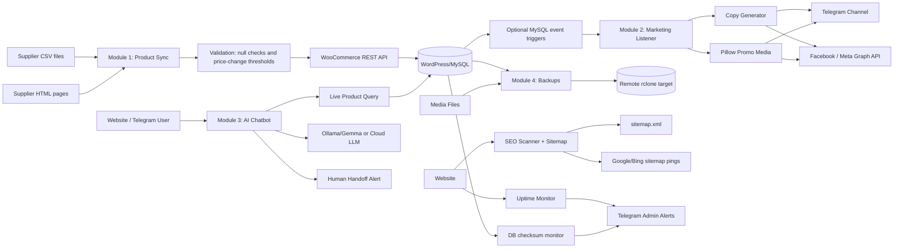

# End-to-End Automated Website Ecosystem

This blueprint implements a low-resource Python automation layer around a WooCommerce/MySQL catalog. All secrets are read from environment variables or `.env`; no credentials are hardcoded.

## Architecture diagram



## Directory structure

```text
automation/
  core/
    config.py              # dataclass settings loaded from .env
    database.py            # SQLAlchemy product repository and checksums
    http.py                # retrying requests session
    logging_config.py      # rotating automation.log setup
    woocommerce.py         # WooCommerce REST API client
  modules/
    product_sync.py        # Module 1 supplier scrape/CSV sync
    marketing.py           # Module 2 copy/media/social posting
    chatbot.py             # Module 3 DB-grounded support bot engine
    backup.py              # Module 4 daily DB/media backups
    seo.py                 # Module 4 broken-link scan + sitemap
    monitor.py             # Module 4 uptime and integrity alerts
  templates/
.env.example
requirements.txt
data_sample_supplier_products.csv
docs/automation_architecture.md
```

## Setup

1. Create and activate a virtual environment.

   ```bash
   python3 -m venv .venv
   source .venv/bin/activate
   pip install -r requirements.txt
   ```

2. Copy `.env.example` to `.env` and set real values.

   ```bash
   cp .env.example .env
   chmod 600 .env
   ```

3. Create the expected runtime folders.

   ```bash
   mkdir -p data media backups
   cp data_sample_supplier_products.csv data/supplier_products.csv
   ```

4. In WooCommerce, create read/write REST credentials and grant only the permissions required for catalog updates.

5. For remote backups, install and configure `rclone`, then set `REMOTE_BACKUP_TARGET` to the remote path.

## Module 1: automated product and price sync

- Reads `data/supplier_products.csv` and optional static supplier pages from `SUPPLIER_URLS`.
- Validates required fields, positive prices, and suspicious price movement.
- Matches WooCommerce products by SKU and updates price/stock through the WooCommerce REST API.

Manual dry run:

```bash
python -m automation.modules.product_sync --dry-run
```

Production run:

```bash
python -m automation.modules.product_sync
```

Cron example for every midnight:

```cron
0 0 * * * cd /path/to/site-automation && /path/to/site-automation/.venv/bin/python -m automation.modules.product_sync >> automation.log 2>&1
```

Windows Task Scheduler action:

```powershell
Program/script: C:\path\to\site-automation\.venv\Scripts\python.exe
Arguments: -m automation.modules.product_sync
Start in: C:\path\to\site-automation
Trigger: Daily at 12:00 AM
```

## Module 2: automated marketing and social posting

- Includes optional MySQL event triggers in `scripts/woocommerce_product_event_triggers.sql` for new-product and price/stock update detection.
- Polls recently modified WooCommerce products as a low-resource fallback and remembers posted product IDs in `data/marketing_state.json`.
- Generates copy with product title, price, contacts, order URL, and a Markdown table.
- Creates a 1080x1080 promotional image with Pillow.
- Posts to Telegram and optionally Facebook/Meta.

```bash
python -m automation.modules.marketing --minutes 30
```

Cron example every 15 minutes:

```cron
*/15 * * * * cd /path/to/site-automation && .venv/bin/python -m automation.modules.marketing --minutes 20 >> automation.log 2>&1
```

## Module 3: intelligent customer service chatbot

The chatbot engine is deliberately RAG-first: it checks FAQs and the live product database before asking the LLM to rephrase. The LLM is not allowed to invent prices or availability.

Command-line test:

```bash
python -m automation.modules.chatbot "What is the price for ABC-001?"
```

Integration options:

- Website widget: call `answer_customer(message, AutomationConfig())` from a Flask/FastAPI endpoint.
- Telegram bot: pass incoming text updates to the same function and send the returned text back with `sendMessage`.
- Human handoff: messages containing bulk, custom, wholesale, negotiation, or discount intent alert `TELEGRAM_ADMIN_CHAT_ID`.

## Module 4: infrastructure, SEO, and security automation

### Backups

```bash
python -m automation.modules.backup
```

Cron example:

```cron
30 1 * * * cd /path/to/site-automation && .venv/bin/python -m automation.modules.backup >> automation.log 2>&1
```

cPanel cron command:

```bash
cd /home/USER/site-automation && /usr/local/bin/python3 -m automation.modules.backup
```

### SEO scan and sitemap generation

```bash
python -m automation.modules.seo --output sitemap.xml --ping
```

### Uptime and database integrity monitoring

```bash
python -m automation.modules.monitor
```

Cron example every five minutes:

```cron
*/5 * * * * cd /path/to/site-automation && .venv/bin/python -m automation.modules.monitor >> automation.log 2>&1
```

## Security and operations notes

- Keep `.env` outside public web roots and set restrictive permissions.
- Rotate WooCommerce, Telegram, Meta, database, and cloud-storage tokens regularly.
- Use least-privilege MySQL users: read access for chatbot/monitoring, write access only where required.
- Keep a staging site for supplier parser changes before production rollout.
- Review `automation.log` and Telegram alerts daily until the workflow is stable.
